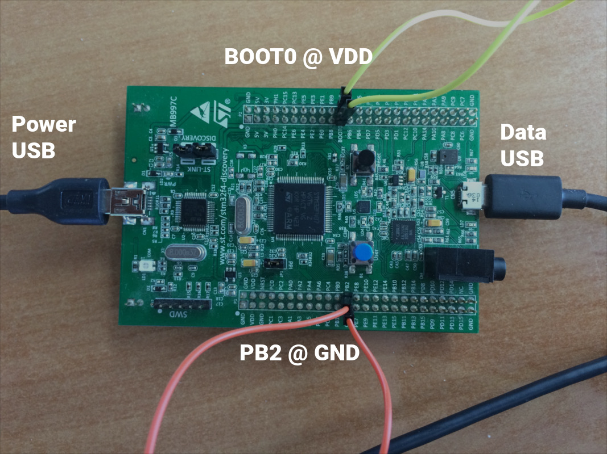

# Introduction
Most microcontrollers are programmed using JTAG for flashing.
However this is not always practical: JTAG adapters are not always available or JTAG connections might not be available for the end user.
To solve this problem a bootloader is employed, which is a small software used to update the microcontroller using a standard communication port such as USB, CAN, Ethernet or UART.

STM32 microcontrollers come with such a bootloader which is stored in the internal boot ROM memory.
This allows us to update the firmware using USB Device Firmware Upgrade (DFU) standard (other communications methods are possible).
DFU is an official USB device class which specifies a vendor and device independent way of updating the firmware of a USB device.
It can be used on a wide range of targets, from microcontrollers to smartphones.

# Installing the requirements
To use the bootloader you will need a host PC running an implementation of the DFU protocol.
The one we recommend using is called [dfu-util][dfu-util] and is available on many platforms, including Windows, Linux and OSX.

It can be installed on Ubuntu by running the following command:

```bash
sudo apt-get install dfu-util
```

Or on OSX, using [Homebrew][homebrew]:

```bash
brew install dfu-util
```

# Preparing the board
According to the STM32F407 Reference Manual[^1], the bootloader resides in system memory.
To instruct the CPU to boot from system memory we must pull BOOT0 to 1 (high) and BOOT1 to 0 (low).

[^1]:
    RM0090
    Reference manual
    STM32F405/415, STM32F407/417, STM32F427/437 and STM32F429/439 advanced ARM®-based 32-bit MCUs

    rev 11

    section 2.4 (Boot configuration),
    table 2 (Boot modes).

*Note:* Since pin BOOT1 is also a GPIO it is named PB2 on some schematics or boards, including the Discovery.

*Note:* To avoid the bootloader entering UART or CAN mode you should stop the traffic coming to those pins.



# Flashing the firmware

Now that our board is ready, we can start the flashing process itself.
We assume that your firmware is now stored in the file `firmware.bin`.
When building the Aseba demo for the Discovery the file can be obtained by running `make ch.bin` and will be located in `build/ch.bin`.
We will flash the code at the beginning of the flash (0x08000000).

Here are the required arguments, see `dfu-util`'s manual for details:

* `-d 0483:df11` specify the vendor & product IDs for the STM32F407.
    They can be obtained from `System Information.app` on OSX and `lsusb` on Linux.
* `-s 0x08000000` tells `dfu-util` that we want to write the binary at the beginning of the flash (address 0x08000000).
* `-D firmware.bin` means we want to download `firmware.bin` to the device.
* `-c 1 -a 0 -i 0` are device interface config flags and should not be changed.

The complete command is therefore:

```bash
dfu-util -d 0483:df11 \
        -c 1 -a 0 -i 0 \
        -s 0x08000000 \
        -D firmware.bin
```

Once the flashing operation is complete, you can remove the bridge between BOOT0 and Vdd.
Reset the microcontroller, and you are done.

# Fixing device permissions on Linux

If you get permission errors on Linux it might be because your user does not have the authorization to access the board.
If this is the case you need to grant explicit permission by placing the following in `/etc/udev/rules.d/50-stm32-dfu.rules`, then rebooting:

```
# STMicroelectronics STM Device in DFU Mode
SUBSYSTEMS=="usb",\
    ATTRS{idVendor}=="0483", ATTRS{idProduct}=="df11",\
    GROUP="plugdev", MODE="0666"
```


[dfu-util]: http://dfu-util.sourceforge.net/
[homebrew]: http://brew.sh/
